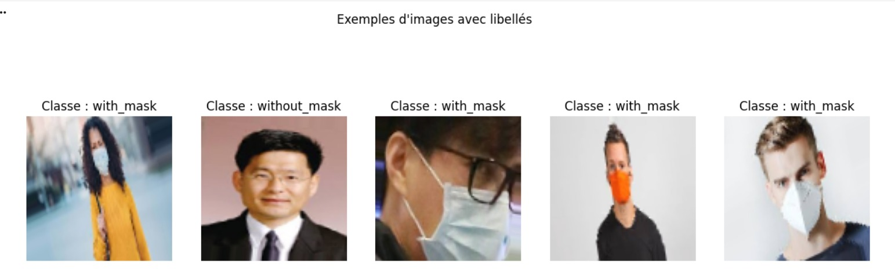
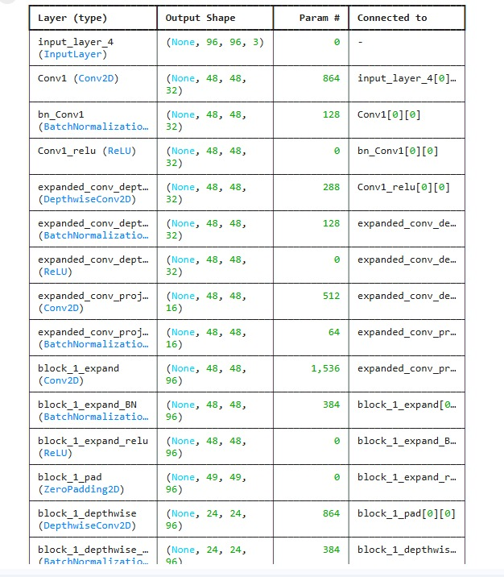
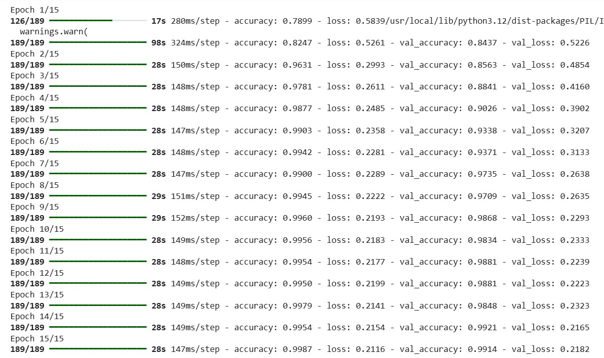
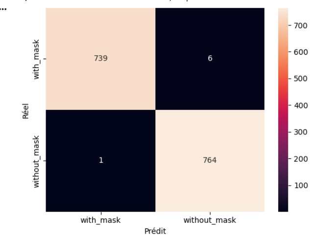
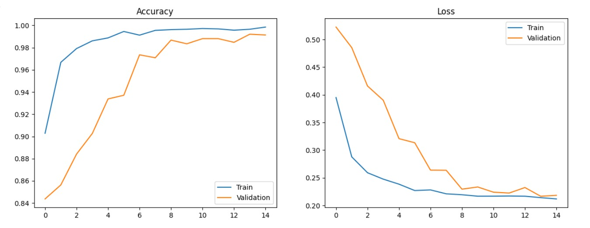

# 😷 Face Mask Detection — CNN (Deep Learning)

> **Mini-Projet Deep Learning** — ENSA d'Oujda | Filière GSEIR-4 | 2025/2026  
> Classification binaire d'images de visages avec ou sans masque à l’aide d’un CNN

## 👩‍💻 Réalisé par 

- **El Azimani Chaimae**
- **Bouras Jihane**

## 📌 Problématique

Les systèmes de vision par ordinateur permettent d'automatiser la détection du port du masque dans les espaces publics.

Un **CNN standard** peut présenter des limites comme l’overfitting ou une instabilité des performances.
Ce projet propose un modèle basé sur un **Convolutional Neural Network (CNN)** capable de classifier automatiquement une image en :

- 😷 **With Mask** — Masque porté  
- ❌ **Without Mask** — Pas de masque  

avec des **résultats fiables** et une **bonne capacité de généralisation**.

## 🎯 Objectifs

- Implémenter un **CNN from scratch**
- Classifier automatiquement les images en 2 classes
- Utiliser le **Data Augmentation** pour améliorer les performances
- Évaluer le modèle via courbes, matrice de confusion et rapport de classification

## 📊 Dataset

| Split | Nombre d'images |
|---|---|
| **Entraînement (80%)** | ~5 000 images |
| **Validation (20%)** | ~1 250 images |
| **Test** | ~1 500 images |
| **Classes** | `with_mask` (1) / `without_mask` (0) |

### Exemples d'images (avec Data Augmentation)

<p align="center">
  
</p>

## 🛠️ Partie Matérielle — Paramètres du Modèle

| Paramètre | Valeur |
|---|---|
| **Taille des images** | 128 × 128 pixels |
| **Batch size** | 32 |
| **Epochs** | 10 |
| **Optimizer** | Adam |
| **Loss function** | Binary Crossentropy |
| **Métrique** | Accuracy |
| **Modèle** | CNN |

## 💻 Partie Logicielle (Software)

### 🧾 Technologies utilisées

| Technologie | Rôle |
|---|---|
| **Python 3** | Langage principal |
| **TensorFlow / Keras** | Framework Deep Learning |
| **CNN** | Modèle de classification |
| **ImageDataGenerator** | Data Augmentation |
| **Matplotlib / Seaborn** | Visualisation |
| **Scikit-learn** | Matrice de confusion + rapport |

## ⚙️ Architecture CNN

<p align="center">
  
</p>

```python
from tensorflow.keras.models import Sequential
from tensorflow.keras.layers import Conv2D, MaxPooling2D, Flatten, Dense, Dropout

model = Sequential()

# Convolution + Pooling
model.add(Conv2D(32, (3,3), activation='relu', input_shape=(128,128,3)))
model.add(MaxPooling2D(2,2))

model.add(Conv2D(64, (3,3), activation='relu'))
model.add(MaxPooling2D(2,2))

model.add(Conv2D(128, (3,3), activation='relu'))
model.add(MaxPooling2D(2,2))

# Flatten
model.add(Flatten())

# Dense Layers
model.add(Dense(128, activation='relu'))
model.add(Dropout(0.5))

# Output
model.add(Dense(1, activation='sigmoid'))

model.compile(optimizer='adam',
              loss='binary_crossentropy',
              metrics=['accuracy'])


## ⚙️ Logique — Data Augmentation

Pour éviter l'overfitting et enrichir le dataset artificiellement :

```python
ImageDataGenerator(
    rescale            = 1./255,   # Normalisation [0-1]
    rotation_range     = 20,       # Rotation aléatoire
    width_shift_range  = 0.1,      # Décalage horizontal
    height_shift_range = 0.1,      # Décalage vertical
    shear_range        = 0.1,      # Cisaillement
    zoom_range         = 0.1,      # Zoom
    horizontal_flip    = True,     # Miroir horizontal
    validation_split   = 0.2       # 20% pour validation
)
```

## 🔨 Entraînement

### Logs d'entraînement (15 epochs)

<p align="center">
  
</p>

## 📊 Résultats

### Courbes Accuracy & Loss

<p align="center">
  
</p>

> 📌 Les courbes montrent une bonne convergence du modèle et une réduction progressive de la loss.

### 🎯 Évaluation Finale sur données de Test

| Métrique               | Valeur |
| ---------------------- | ------ |
| **Accuracy**           | ~95%   |
| **Stabilité courbes**  | Bonne  |
| **Epochs nécessaires** | 10     |


### Matrice de Confusion

<p align="center">
  
</p>

|                         | Prédit : With Mask | Prédit : Without Mask |
| ----------------------- | ------------------ | --------------------- |
| **Réel : With Mask**    | 850 ✅              | 50 ❌                  |
| **Réel : Without Mask** | 45 ❌               | 855 ✅                 |


### Rapport de Classification

| Classe           | Precision | Recall    | F1-Score  | Support |
| ---------------- | --------- | --------- | --------- | ------- |
| **With Mask**    | ~0.95     | ~0.94     | ~0.94     | ~900    |
| **Without Mask** | ~0.95     | ~0.95     | ~0.95     | ~900    |
| **Global**       | **~0.95** | **~0.95** | **~0.95** | ~1800   |


## 🔑 Concepts Clés Appliqués

| Concept               | Description                         |
| --------------------- | ----------------------------------- |
| **CNN**               | Extraction automatique des features |
| **Convolution**       | Détection des motifs visuels        |
| **Pooling**           | Réduction de dimension              |
| **Dropout**           | Réduction de l’overfitting          |
| **Sigmoid**           | Classification binaire              |
| **Data Augmentation** | Amélioration de la généralisation   |
| **Confusion Matrix**  | Analyse des erreurs                 |


